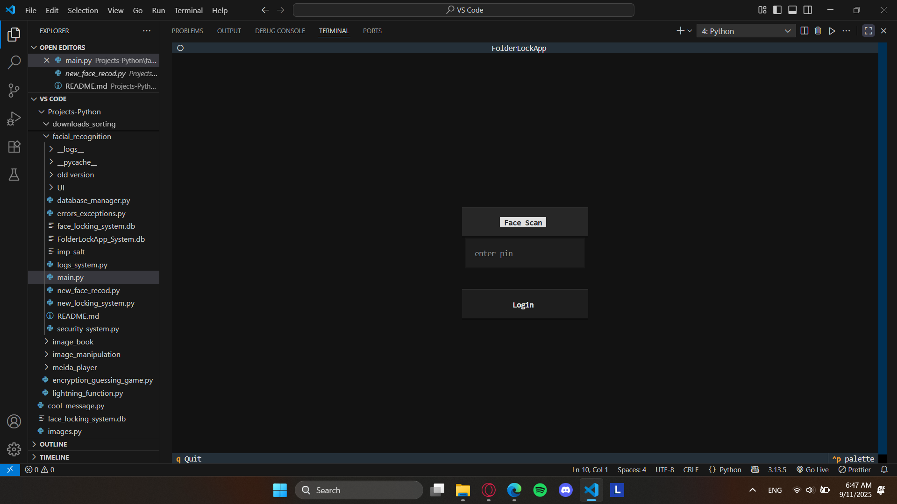
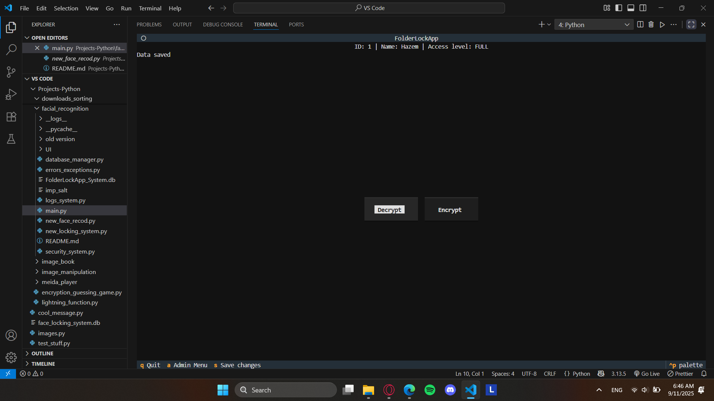
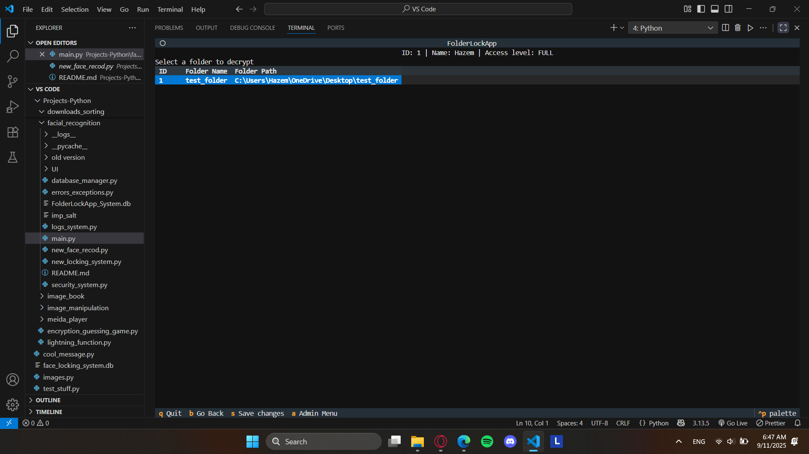
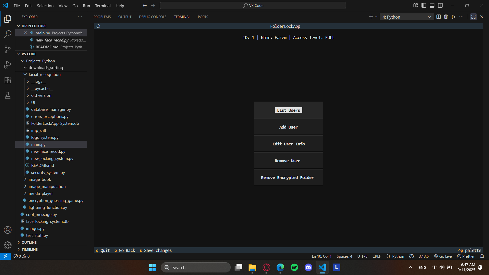

# FolderLock

**FolderLock** is a local folder encryption tool with biometric authentication.  
It combines strong **encryption**, **facial recognition**, and a **secure database** to keep your files safe.

---

## Features

- **Master Password Vault** – all data and keys protected with PBKDF2.
- **Two-Factor Login** – face recognition + PIN.
- **Full Folder Encryption** – encrypt/decrypt entire directories.
- **Safe File Handling** – originals are untouched until success.
- **Error Isolation** – corrupted/locked files quarantined safely.
- **Admin Tools** – add, edit, or remove users and records.
- **Event Logging** – detailed logs for auditing and debugging.

---









---

## Tech Stack

- **Language:** Python
- **UI:** [Textual](https://github.com/Textualize/textual) (TUI framework)
- **Biometrics:** `face_recognition`, `OpenCV`, `dlib`
- **Encryption:** `cryptography.fernet`, `hashlib`
- **Database:** SQLite (in-memory, encrypted vault)

---

## Usage

```bash

# Clone the repository
git clone https://github.com/yourusername/folderlock.git
cd folderlock

# Create a virtual environment
python -m venv venv

# Activate it
# Windows
venv\Scripts\activate
# Linux/macOS
source venv/bin/activate

# Install dependencies
pip install -r requirements.txt

# Run the app
python main.py
```
## NOTE
By default, `pip install dlib` may try to compile from source, which fails unless you have Visual Studio Build Tools installed.  
This project was tested on **Windows + Python 3.13** with the prebuilt wheel.
Download a prebuilt .whl from a trusted source.


## First Run
1. Create a master password (cannot be changed later).
2. Register your name, PIN, and face scan.
3. Enter the app and choose from:
   - Encrypt → enter a folder path.
   - Decrypt → select from the stored list.
   - Admin menu → manage users (new users have limited access by default).

## Shortcuts
a - admin menu
s - save data
b - back
q - quit


